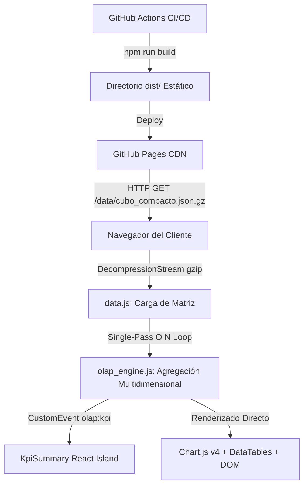

# Arquitectura del Sistema — Métrica AV y RTU

Este documento describe la arquitectura técnica, flujo de datos, gestión de memoria y estrategia de despliegue en **GitHub Pages** del tablero de Business Intelligence y Auditoría **Métrica AV y RTU**.

---

## 1. Visión General de la Arquitectura

El proyecto está diseñado como una **Aplicación Web Estática de Alto Rendimiento (SSG / Static Site Generation)** impulsada por [Astro](https://astro.build/) y renderizada en el cliente mediante un **Motor OLAP en Memoria de Pase Único ($O(N)$)**.



---

## 2. Componentes Clave y Stack Tecnológico

1. **Astro Framework (v5.3+):**
   - Generación de rutas estáticas (`/` y `/auditoria`).
   - Inyección de variables de entorno (`import.meta.env.BASE_URL`) para compatibilidad automática con GitHub Pages sub-paths (`/Metrica-AV-Y-RTU/`).
   - Integración de TailwindCSS para diseño responsive y componentes React (`@astrojs/react`).

2. **Cargador Asíncrono de Datos (`public/js/data.js`):**
   - Descarga el dataset pre-agregado de 865.8k trámites en formato comprimido `cubo_compacto.json.gz` (1.5 MB).
   - Utiliza la API nativa `DecompressionStream('gzip')` del navegador para descompresión en memoria sin librerías externas.
   - Cuenta con fallback automático a `.json` estándar y botón interactivo de reintento en caso de fallo de red.

3. **Motor OLAP en Memoria (`public/js/olap_engine.js`):**
   - Ejecuta agregaciones multidimensionales reactivas (Región, Tipo de Trámite, Año, Mes, Macrocausal, Personería) en **menos de 15 milisegundos**.
   - Algoritmo de **pase único $O(N)$** sin recursividad ni clonación innecesaria de objetos en memoria.

4. **Visualización y Gráficos (`public/js/charts.js` & `public/js/app.js`):**
   - 12 instancias de Chart.js v4 configuradas con paletas institucionales accesibles y tipografía clara.
   - Destrucción segura y actualización `update('none')` para evitar fugas de memoria (*memory leaks*).
   - Manejador global `window.resizeAllCharts()` con *debounce* para redimensionamiento fluido en ventanas y rotación de dispositivos móviles.

5. **Navegación e Interacción Accesible (`src/layouts/MainLayout.astro`):**
   - Sistema de pestañas con roles WAI-ARIA (`role="tab"`, `role="tabpanel"`, `aria-controls`, `aria-selected`).
   - Paleta de Comandos (`Ctrl+K` / `⌘K`) para búsqueda global de métricas y gráficos.
   - Modal Metodológico interactivo para trazabilidad matemática de cada indicador.

---

## 3. Flujo de Datos y Ciclo de Vida del Estado

```text
[Carga Inicial de Página]
       │
       ▼
[Descarga / Descompresión de cubo_compacto.json.gz]
       │
       ├── ÉXITO ➔ [DATA.loaded = true] ➔ [dataReady Event]
       │                                         │
       │                                         ▼
       │                          [processOlapFilters(cubo, ...)]
       │                                         │
       │                         ┌───────────────┴───────────────┐
       │                         ▼                               ▼
       │                 [KpiSummary React]              [Chart.js / DOM Update]
       │
       └── ERROR ➔ [Mostrar #dataErrorBanner] ➔ [Botón Reintentar Carga]
```

---

## 4. Pipeline de CI/CD en GitHub Actions (`.github/workflows/deploy.yml`)

El pipeline valida automáticamente la integridad antes de cualquier despliegue a producción:

1. **Checkout del Código:** `actions/checkout@v4`.
2. **Entorno Node.js:** Node.js v24 con caché de dependencias `npm`.
3. **Instalación Limpia:** `npm ci`.
4. **Ejecución de Pruebas Unitarias:** `npm test` (Vitest). Si alguna prueba de cálculo o consistencia falla, el despliegue se cancela inmediatamente.
5. **Compilación Estática:** `npm run build` (Astro genera `/dist`).
6. **Despliegue a GitHub Pages:** `actions/deploy-pages@v4`.

---

## 5. Medidas de Seguridad y Privacidad

- **Cero Secretos Expuestos:** No existen tokens, credenciales ni claves privadas en el repositorio.
- **Anonimización Forense:** Todos los expedientes de muestra en `dataset_muestral_500` utilizan identificadores sintéticos anonimizados (`EXP-2026-XXXXX`), sin datos tributarios sensibles ni PII (Información de Identificación Personal).
- **Archivos Estáticos Seguros:** Todos los scripts son servidos localmente desde `/vendor/` y `/js/`, eliminando dependencias externas de CDNs no confiables.
