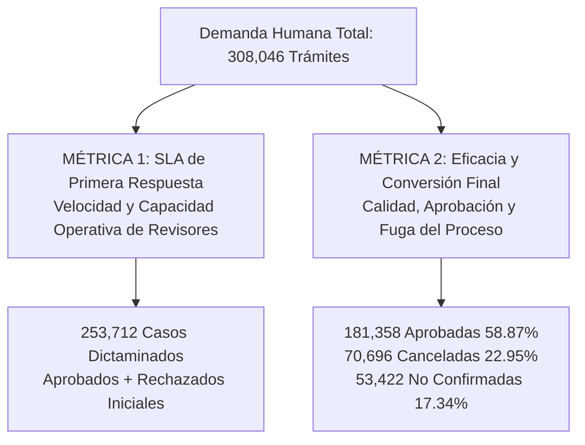
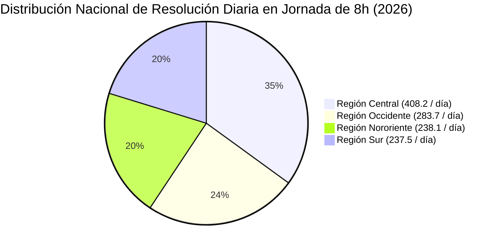
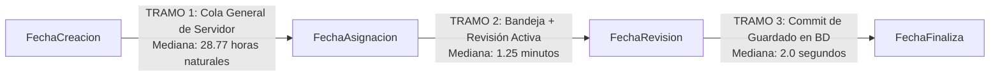

# Informe Ejecutivo de Métricas Operativas AV y RTU — 2026
## Análisis Integral de Gestiones Humanas (Activación y Cambio de Correo)

---

### Resumen Ejecutivo & KPIs Clave (2026)

Este informe consolida la auditoría analítica y operativa de **308,046 gestiones** tramitadas durante el año **2026**, correspondientes exclusivamente a flujos atendidos por operadores humanos (*Activación* y *Cambio de Correo Electrónico*), habiendo depurado los trámites automatizados de autoservicio (*Reinicio de Contraseña*).

| Métrica Clave | Valor 2026 | Interpretación Operativa |
| :--- | :---: | :--- |
| **Universo de Gestiones Humanas** | **308,046** | Trámites totales creados en 2026 operados por humanos. |
| **Solicitudes Dictaminadas por Revisor** | **253,712** | **82.36%** llegaron a manos de un operador (excluye fugas de no confirmación). |
| **Capacidad Diaria Nacional (8h)** | **1,166 gestiones / día** | Ritmo promedio de resolución del equipo completo en jornada hábil (8:00 a 16:00). |
| **Distribución Regional de Carga (8h)** | **Central 35% \| Occidente 24.3% \| Nororiente 20.4% \| Sur 20.3%** | Balance de capacidad y volumen en las 4 gerencias regionales. |
| **SLA 1ª Respuesta $\le 3$ Días Hábiles** | **81.31%** | **206,303 casos** recibieron su primer dictamen (Aprobado/Rechazado) en $\le 24$h hábiles. |
| **Tasa de Resolución de Casos Atendidos** | **71.95%** | De los casos revisados por operadores, el 71.95% culminó en aprobación. |
| **First-Time Resolution (1ª Intento Limpio)** | **70.62%** | **217,550 gestiones** aprobadas directamente sin rechazo previo. |
| **Rechazos Recuperados y Aprobados** | **47.20%** | **42,287 gestiones** rechazadas lograron subsanarse y aprobarse. |
| **Rechazos Huérfanos (Sin Motivo)** | **51.42%** | **46,064 rechazos** carecen de descripción en `MotivoRechazo`. |
| **Tiempo Mediano Operativo Real** | **1.25 min** | Tiempo neto en que el revisor valida y dictamina (`Asignación` $\rightarrow$ `Revisión`). |
| **Fuerza Operativa Activa** | **172 revisores** | Operadores humanos con actividad registrada en el año. |

---

### 1. El Marco Dual de Medición: Velocidad vs. Efectividad

Para evitar el **Sesgo de Supervivencia** (*evaluar únicamente los casos exitosos ignorando el 29.1% de carga de trabajo que implican los rechazos*), el desempeño se divide formalmente en dos dimensiones:

---

### 2. Métrica 1: SLA de Primera Respuesta (Eficiencia Operativa 2026)

* **Universo:** **253,712 solicitudes** que llegaron efectivamente a la bandeja de los operadores y recibieron un dictamen humano (sea `APROBADA` directa o `RECHAZADA`).
* **Fórmula:** $\text{Min}(\text{FechaRechazo}, \text{FechaFinaliza}) - \text{FechaCreacion}$ (calculada en **Horas Hábiles Laborales: Lun-Vie 8:00 a 16:00 = 8h netas/día**).

| Cumplimiento de Primera Respuesta | Casos 2026 | % Acumulado | Interpretación de SLA |
| :--- | :---: | :---: | :--- |
| **$\le 1$ Jornada Hábil ($\le 8$h hábiles)** | **121,784** | **48.00%** | Casi la mitad de los usuarios recibe dictamen el 1er día hábil. |
| **$\le 2$ Jornadas Hábiles ($\le 16$h hábiles)** | **179,914** | **70.91%** | 7 de cada 10 usuarios son atendidos en $\le 2$ días hábiles. |
| **$\le 3$ Días Hábiles ($\le 24$h hábiles)** | **206,303** | **81.31%** | Más del 80% atendido dentro del estándar tri-diario. |
| **$\le 5$ Días Hábiles ($\le 40$h / 1 semana)** | **235,868** | **92.97%** | Más del 92% resuelto en la primera semana laboral. |
| **Mediana en Horas Hábiles Netas** | — | **8.53 hrs** | ~1 jornada hábil + 30 min. |
| **Mediana en Horas Naturales (Reloj)** | — | **38.76 hrs** | ~1.6 días calendario totales. |

---

### 3. Métrica 2: Eficacia y Conversión Final (Calidad y Fuga 2026)

| Estado / Desenlace del Trámite | Gestiones 2026 | % del Total Entrante | Impacto Operativo |
| :--- | :---: | :---: | :--- |
| **Aprobadas con Éxito (`APROBADA`)** | **181,358** | **58.87%** | Contribuyentes que completaron su trámite satisfactoriamente. |
| **Canceladas / Bajas Definitivas** | **70,696** | **22.95%** | Bajas por requerimiento no atendido, límite de rechazos o desistimiento. |
| **Fuga Inicial Pre-Atención (`NO CONFIRMADA`)** | **53,422** | **17.34%** | Ciudadanos que no validaron el enlace de token en su correo (nunca llegó al revisor). |
| **Gestiones en Trámite / Otras** | **2,570** | **0.84%** | En tránsito operativo al corte. |
| **TOTAL UNIVERSO HUMANO** | **308,046** | **100.00%** | — |

---

### 4. Capacidad Diaria Nacional en Jornadas de 8 Horas (08:00 a 16:00)

En los **166 días hábiles activos** de 2026, el equipo completo de 172 revisores dictamina en horario laboral:

| Métrica de Producción Diaria (Jornada 8h) | Valor Promedio Diario | Rango Operativo Observado |
| :--- | :---: | :---: |
| **Total Gestiones Dictaminadas / Día (8h)** | **1,166.0 gestiones / día** | Mediana: **1,241 / día** (Pico máx: 2,497) |
| **• Gestiones Aprobadas / Día** | **898.6 aprobadas / día** | *(77.1% de la producción diaria)* |
| **• Gestiones Rechazadas / Día** | **333.4 rechazadas / día** | *(22.9% de la producción diaria)* |

---

### 5. Análisis Multirregional de Capacidad y Rankings de Revisores (2026)

#### A. Balance Comparativo de las 4 Gerencias Regionales (Jornada 8h)

| Región | Total Resuelto (8h) | % Nacional | **Promedio Diario (8h)** | Mediana Diaria | Pico Máximo (1 Día) | Aprobadas / Día | Rechazadas / Día |
| :--- | :---: | :---: | :---: | :---: | :---: | :---: | :---: |
| **CENTRAL** | **67,756** | **35.00%** | **408.2 gestiones / día** | 405.5 / día | 1,173 casos | 273.4 / día | 142.4 / día |
| **OCCIDENTE** | **47,100** | **24.33%** | **283.7 gestiones / día** | 296.5 / día | 750 casos | 236.1 / día | 84.0 / día |
| **NORORIENTE** | **39,519** | **20.42%** | **238.1 gestiones / día** | 255.0 / día | 519 casos | 203.3 / día | 58.6 / día |
| **SUR** | **39,188** | **20.25%** | **237.5 gestiones / día** | 254.0 / día | 576 casos | 198.6 / día | 49.4 / día |

---

#### B. Rankings de Revisores por Cada Gerencia Regional (Jornada 8h)

##### 1. REGIÓN CENTRAL (67,756 dictaminadas en 8h)
| Revisor | Total en 8h | **Promedio Diario (8h)** | Mediana Diaria | Máximo en 1 Día | Días Activos | % Aprobación |
| :--- | :---: | :---: | :---: | :---: | :---: | :---: |
| 🥇 **ERCORZAN** | **11,213** | **80.1 casos / día** | 91.5 / día | **127 casos** | 140 días | 98.3% |
| 🥈 **AMHERNAN** | **7,668** | **60.4 casos / día** | 68.0 / día | **104 casos** | 127 días | 97.7% |
| 🥉 **FACRUZRI** | **5,884** | **57.1 casos / día** | 65.0 / día | **113 casos** | 103 días | 97.7% |
| 4. **JRSILVAR** | **5,427** | **53.2 casos / día** | 49.0 / día | **125 casos** | 102 días | 97.8% |
| 5. **KMDELEON** | **2,404** | **46.2 casos / día** | 33.0 / día | **106 casos** | 52 días | 96.8% |
| 6. **MJMARTIR** | **2,408** | **29.7 casos / día** | 20.0 / día | **92 casos** | 81 días | 86.2% |

##### 2. REGIÓN OCCIDENTE (47,100 dictaminadas en 8h)
| Revisor | Total en 8h | **Promedio Diario (8h)** | Mediana Diaria | Máximo en 1 Día | Días Activos | % Aprobación |
| :--- | :---: | :---: | :---: | :---: | :---: | :---: |
| 🥇 **PAPEREZT** | **6,265** | **66.6 casos / día** | 68.5 / día | **161 casos** | 94 días | 98.4% |
| 🥈 **RAGUILAR** | **4,463** | **63.8 casos / día** | 73.0 / día | **145 casos** | 70 días | 97.9% |
| 🥉 **EENAVARR** | **5,277** | **55.5 casos / día** | 61.0 / día | **132 casos** | 95 días | 95.8% |
| 4. **MECABRER** | **4,761** | **55.4 casos / día** | 52.5 / día | **141 casos** | 86 días | 98.6% |
| 5. **CRAGUILA** | **2,731** | **46.3 casos / día** | 41.0 / día | **127 casos** | 59 días | 99.4% |
| 6. **APMIRAND** | **2,470** | **30.9 casos / día** | 24.5 / día | **126 casos** | 80 días | 98.4% |

##### 3. REGIÓN SUR (39,188 dictaminadas en 8h)
| Revisor | Total en 8h | **Promedio Diario (8h)** | Mediana Diaria | Máximo en 1 Día | Días Activos | % Aprobación |
| :--- | :---: | :---: | :---: | :---: | :---: | :---: |
| 🥇 **MKNAJERA** | **12,266** | **111.5 casos / día** | 118.5 / día | **191 casos** | 110 días | 99.3% |
| 🥈 **EOVALIEN** | **8,187** | **71.8 casos / día** | 70.0 / día | **166 casos** | 114 días | 99.2% |
| 🥉 **AMCALELA** | **2,239** | **49.8 casos / día** | 48.0 / día | **106 casos** | 45 días | 99.2% |
| 4. **AAORELLR** | **1,225** | **31.4 casos / día** | 9.0 / día | **145 casos** | 39 días | 99.0% |
| 5. **KEDIAZPA** | **1,213** | **20.9 casos / día** | 21.0 / día | **56 casos** | 58 días | 99.0% |
| 6. **MLRIVERA** | **1,535** | **13.2 casos / día** | 12.0 / día | **38 casos** | 116 días | 95.5% |

##### 4. REGIÓN NORORIENTE (39,519 dictaminadas en 8h)
| Revisor | Total en 8h | **Promedio Diario (8h)** | Mediana Diaria | Máximo en 1 Día | Días Activos | % Aprobación |
| :--- | :---: | :---: | :---: | :---: | :---: | :---: |
| 🥇 **AMVELIZM** | **12,169** | **94.3 casos / día** | 102.0 / día | **217 casos** | 129 días | 98.0% |
| 🥈 **FOMONZON** | **10,457** | **75.8 casos / día** | 83.0 / día | **136 casos** | 138 días | 97.8% |
| 🥉 **RSISRODR** | **3,238** | **42.6 casos / día** | 13.5 / día | **166 casos** | 76 días | 98.7% |
| 4. **BEORTEGA** | **2,884** | **35.6 casos / día** | 17.0 / día | **156 casos** | 81 días | 98.9% |
| 5. **LIBARRIE** | **626** | **25.0 casos / día** | 3.0 / día | **160 casos** | 25 días | 99.7% |
| 6. **REGARCIB** | **1,194** | **18.4 casos / día** | 16.0 / día | **54 casos** | 65 días | 99.8% |

---

### 6. Desglose de los 3 Tramos del Ciclo Operativo

| Tramo de Tiempo | P25 | **Mediana (P50)** | P75 | P95 | Promedio | % del Ciclo Total |
| :--- | :---: | :---: | :---: | :---: | :---: | :---: |
| **Tramo 1: Creación $\rightarrow$ Asignación** *(Cola de espera general antes de entrar a bandeja)* | 18.70 hrs | **28.77 hrs** | 66.10 hrs | 139.10 hrs | 46.79 hrs | **95.7%** |
| **Tramo 2: Asignación $\rightarrow$ Revisión** *(Tiempo en bandeja + revisión activa del operador)* | 0.83 min *(50s)* | **1.25 min** *(75s)* | 2.83 min *(170s)* | 14.61 hrs | 124.31 min | **4.2%** |
| **Tramo 3: Revisión $\rightarrow$ Finalización** *(Latencia de guardado/transacción en base de datos)* | 1.00 seg | **2.00 seg** | 2.00 seg | 3.00 seg | 2.09 seg | **< 0.1%** |
| **CICLO TOTAL: Creación $\rightarrow$ Finalización** | 19.02 hrs | **30.96 hrs** | 67.50 hrs | 143.15 hrs | 48.86 hrs | **100.0%** |

---

### 7. Diagnóstico de Rechazos Huérfanos (Sin Motivo Registrado)

Se identificaron **46,064 eventos de rechazo** en 2026 donde el campo `MotivoRechazo` quedó completamente en blanco (**51.42% de todos los rechazos**).

* **El 91.80% (42,287 casos)** culminaron posteriormente en estado **`APROBADA`** (reprocesos tácitos donde el operador aprobó la subsanación).
* **El 8.20% (3,777 casos)** terminaron canceladas definitivamente sin dejar trazabilidad de la causa.

---

### 8. Resumen de Hallazgos y Acciones Recomendadas

> [!IMPORTANT]
> 1. **Balanceo de Carga Multirregional**: Central absorbe el 35.0% de la demanda del país (408 casos/día). Replicar la automatización de asignación observada en Sur y Nororiente desahogará la cola de la capital.
> 2. **Implementación del Marco Dual**: Reportar formalmente tanto el **SLA de Primera Respuesta (81.31% en $\le 3$ días)** como la **Tasa de Éxito Final (71.95%)** para reflejar la capacidad completa del equipo sin sesgos.
> 3. **Obligatoriedad de Motivo**: Implementar validación en frontend para eliminar los 46,064 rechazos sin tipificación formal.
