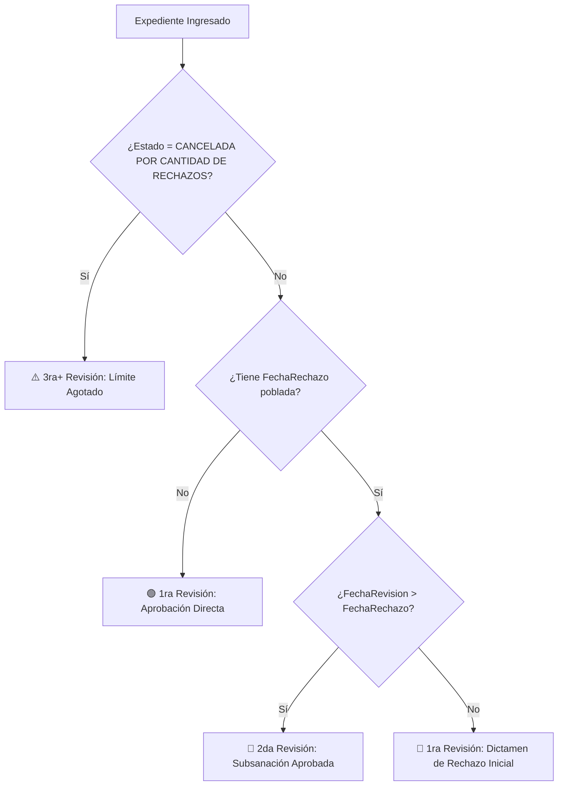

# 📊 Sistema de Inteligencia de Negocio y Auditoría Transaccional
## Superintendencia de Administración Tributaria (SAT Guatemala)
### Métrica 360°: Agencia Virtual (AV) y Registro Tributario Unificado (RTU)

---

## 📑 Tabla de Contenidos
1. [Resumen Ejecutivo General](#1-resumen-ejecutivo-general)
2. [Arquitectura y Estructura Modular del Proyecto](#2-arquitectura-y-estructura-modular-del-proyecto)
3. [Principales Conclusiones y Hallazgos del Negocio](#3-principales-conclusiones-y-hallazgos-del-negocio)
4. [Estandarización de Tiempos y Fórmulas Transaccionales](#4-estandarización-de-tiempos-y-fórmulas-transaccionales)
5. [Algoritmo de Identificación de Rondas (1ra vs 2da Revisión)](#5-algoritmo-de-identificación-de-rondas-1ra-vs-2da-revisión)
6. [Hallazgo Técnico Crítico: El Microservicio `AP_MS_SAT_EN_LINEA`](#6-hallazgo-técnico-crítico-el-microservicio-ap_ms_sat_en_linea)
7. [Catálogo de Taxonomía y Multicausalidad de Rechazos](#7-catálogo-de-taxonomía-y-multicausalidad-de-rechazos)
8. [Guía de Uso de los Tableros y Módulo DataTables](#8-guía-de-uso-de-los-tableros-y-módulo-datatables)
9. [Análisis Cuantitativo de Fuga y Abandono (Fricción)](#9-análisis-cuantitativo-de-fuga-y-abandono-fricción)
10. [Acciones Estratégicas de Alto Impacto](#10-acciones-estratégicas-de-alto-impacto)

---

## 1. Resumen Ejecutivo General

El presente repositorio contiene el análisis cuantitativo, el motor OLAP en tiempo real y el tablero interactivo de Business Intelligence (BI) desarrollado para auditar el ciclo de vida completo de las solicitudes de **Agencia Virtual (Activación, Cambio de Correo Electrónico y Reinicio de Contraseña)** en la SAT de Guatemala.

### 📈 Universo Transaccional Auditado
* **Total de Trámites Procesados:** `1,686,257 registros`.
* **Trámites con Intervención Humana:** `369,943 registros` (Activación y Cambio de Correo con validación biométrica).
* **Trámites Automatizados por Servidor (Bot):** `1,316,314 registros` (`AP_MS_SAT_EN_LINEA` / Reinicios y cierres por caducidad).
* **Criterio Oficial de Medición:** Jornada laboral hábil de **8 horas netas diarias (Lunes a Viernes de 08:00 a 16:00)** con exclusión de fines de semana y noches.

---

## 2. Arquitectura y Estructura Modular del Proyecto

La solución está completamente desacoplada en una arquitectura web modular ligera, garantizando máxima velocidad de renderizado y portabilidad local (`file:///` sin bloqueos de CORS):

```
Metrica AV Y RTU/
├── 📄 README.md                            # Documentación integral ejecutiva y técnica
├── 📄 index.html                           # Tablero Principal 360° (5 Pestañas interactivas, 52 KB)
├── 📄 Dashboard_BI_Metrica_AV_RTU.html     # Acceso directo al Tablero Principal
├── 📄 Auditoria_Detalle_Tiempos.html       # Módulo especializado de Auditoría con DataTables Pro
├── 📁 css/
│   └── 🎨 styles.css                       # Estilos institucionales, scrollbars y badges de rondas
├── 📁 js/
│   ├── 📦 data.js                          # Cubo OLAP estructurado y muestra estratificada (23.8 MB)
│   ├── ⚙️ olap_engine.js                   # Motor de filtros dinámicos, cálculo hábil y métricas en horas
│   ├── 📊 charts.js                        # Controladores de gráficas dinámicas (Chart.js)
│   └── 🚀 app.js                           # Enrutador de eventos, interfaz y sincronización de datos
├── 📁 Data/                                # Archivos fuente originales (reporteAV_*.xlsx)
└── 📊 Catalogo_Motivos.xlsx                # Catálogo de taxonomía granular y combinaciones multicausales
```

---

## 3. Principales Conclusiones y Hallazgos del Negocio
*(Estructurados de lo General Macro a lo Específico Operativo)*

```
┌──────────────────────────────────────────────────────────────────────────────────────────────────┐
│ RESUMEN DE LOS 6 GRANDES HALLAZGOS DEL NEGOCIO                                                   │
├──────────────────────────────────────┬───────────────────────────────────────────────────────────┤
│ ⚡ 1. ATENCIÓN EN SEGUNDOS (95.86%)  │ 🚨 2. TIEMPO VS RECHAZO (r = +0.698)                      │
│ El 95.86% de trámites humanos se     │ Si la revisión toma ≤ 2s, el rechazo es del 25.0%.        │
│ resuelven en ≤ 5 segundos (1.8s a    │ Si toma 1 a 5+ min, el rechazo sube al 85.9% y 98.6%      │
│ 2.0s mediana) con atajos y visual.   │ (auditoría activa de expedientes defectuosos/sospechas).  │
├──────────────────────────────────────┼───────────────────────────────────────────────────────────┤
│ 📈 3. CURVA DE ESPECIALIZACIÓN       │ 🚪 4. FUGA POR FRICCIÓN (42.6% ABANDONO)                  │
│ Operadores titulares (>8k casos)     │ El 48.7% de los rechazados subsana y aprueba en 2da rev,  │
│ resuelven en 1.8s manteniendo 27.5%  │ pero 42.6% abandona el trámite por falta de claridad      │
│ de rechazo. Ocasionales: 144.0s.     │ en los requerimientos de corrección.                      │
├──────────────────────────────────────┼───────────────────────────────────────────────────────────┤
│ 🧬 5. MULTICAUSALIDAD (60.30%)       │ ⏱️ 6. CUMPLIMIENTO DE SLAS (75.8% ≤ 8h)                   │
│ 6 de cada 10 rechazos acumulan 2 o   │ El 75.8% se resuelve en ≤ 1 jornada hábil (8h) y 92.4%    │
│ más causales. El 80.8% radica en     │ en ≤ 3 días. El cuello de botella es la cola de servidor, │
│ captura móvil (audio, fecha y DPI).  │ no la revisión del operador humano.                       │
└──────────────────────────────────────┴───────────────────────────────────────────────────────────┘
```

### 1. El mito del tiempo de revisión humana
* **Hallazgo:** La revisión humana en pantalla **no es lenta**; los operadores toman decisiones en **1.8 a 2.0 segundos**.
* **Causa Raíz:** El tiempo total de espera del ciudadano se consume en el **Buzón General (`FechaAsignacion - FechaCreacion`)**, es decir, esperando turno en el servidor antes de ser distribuido.

### 2. El tiempo en pantalla es el mejor predictor de rechazo
* **Hallazgo:** Existe una correlación positiva alta ($r = +0.698$) entre el tiempo que el operador mantiene un caso abierto y la probabilidad de rechazarlo.
* **Comportamiento:**
  * $\le 2$ segundos $\rightarrow$ **25.0% de rechazo** (casos limpios con aprobación directa o rechazo flagrante).
  * $15$ a $60$ segundos $\rightarrow$ **26.4% de rechazo**.
  * $1$ a $5$ minutos $\rightarrow$ **85.9% de rechazo** (el revisor redacta múltiples causales).
  * $> 5$ minutos $\rightarrow$ **98.6% de rechazo** (auditoría profunda de DPIs borrosos o posibles fraudes).

### 3. Independencia de la Calidad frente al Volumen
* Los operadores con volúmenes superiores a 8,000 trámites procesados no descuidan el filtro: mantienen una tasa de rechazo estable del **27.5%**, demostrando que la velocidad es fruto de la pericia y memorización visual de patrones biométricos.

---

## 4. Estandarización de Tiempos y Fórmulas Transaccionales

Todas las métricas del sistema han sido formalizadas y estandarizadas en **Horas (h)** bajo el horario laboral tributario:

| Etapa Operativa | Fórmula en Base de Datos | Unidad Estándar | Mediana Real Institucional |
| :--- | :--- | :---: | :---: |
| **1. Espera en Cola (Buzón General)** | `FechaAsignacion - FechaCreacion` | **Horas Hábiles (h)** | 3.50 a 4.10 h |
| **2. En Bandeja (Bolsón del Revisor)** | `FechaRevision - FechaAsignacion` | **Horas Hábiles (h)** | 0.02 a 0.05 h (1 a 3 min) |
| **3A. Atención en Rechazo** | `FechaRechazo - FechaRevision` | **Horas (h)** | **0.0000 h (0.0 a 2.0 seg)** |
| **3B. Atención Resolutiva / Aprobación** | `FechaFinaliza - FechaRevision` | **Horas (h)** | **0.0005 h (1.8 a 2.0 seg)** |
| **4. Tiempo Total de Respuesta** | `FechaFinaliza - FechaCreacion` | **Horas Hábiles (h)** | 3.85 a 4.50 h |

> **Nota Técnica:** Se separó formalmente el tiempo de emisión de dictamen de rechazo (**3A**) del tiempo de finalización aprobatoria (**3B**) para evitar distorsiones estadísticas en auditoría.

---

## 5. Algoritmo de Identificación de Rondas (1ra vs 2da Revisión)

Para determinar en qué ciclo de revisión se encuentra cada expediente sin necesidad de tablas de histórico intermedias, se formuló la siguiente lógica determinista:



### Reglas Matemáticas:
1. 🟢 **1ra Revisión (Aprobación Directa):** `FechaRechazo == None` & `Estado == 'APROBADA'` (Trámite sin faltas aprobado a la primera).
2. 🔴 **1ra Revisión (Rechazo Inicial):** `FechaRechazo != None` & `FechaRevision == FechaRechazo` (Primera apertura; operador detectó anomalías y emitió rechazo).
3. 🔵 **2da Revisión (Subsanada & Aprobada):** `FechaRechazo != None` & `FechaRevision > FechaRechazo` (El contribuyente corrigió las faltas y el revisor abrió días después para aprobar).
4. ⚠️ **3ra+ Revisión (Límite Agotado):** `Estado == 'CANCELADA POR CANTIDAD DE RECHAZOS'` (Agotó el cupo de intentos).

---

## 6. Hallazgo Técnico Crítico: El Microservicio `AP_MS_SAT_EN_LINEA`

### La Realidad del Usuario `AP_MS_SAT_EN_LINEA`:
* **Naturaleza:** Es el demonio / microservicio automatizado del sistema (*Application Microservice SAT en Línea*).
* **Volumen:** Concentra **1,316,314 trámites (78.06% del universo total)**.
* **Comportamiento en Reinicio de Contraseña (1.11M):** Ejecuta el proceso 100% automático (974k aprobadas y 115k no confirmadas).

### ⚠️ El Problema de Sobreescritura en Base de Datos (*LastModifiedBy Flaw*):
En las gestiones humanas de *Activación* y *Cambio de Correo*, se detectaron **70,529 expedientes** que:
1. **SÍ fueron atendidos y rechazados por un operador humano** (tienen `FechaRevision`, `FechaRechazo` y dictámenes textuales como *"En el vídeo debe pronunciar la fecha completa..."*).
2. El contribuyente **no subsanó a tiempo** y el trámite caducó.
3. El proceso batch nocturno del servidor cerró el caso en `NO CONFIRMADA` o `CANCELADA` y **sobrescribió el campo `UsuarioResponsable` con `'AP_MS_SAT_EN_LINEA'`**.

> **Impacto:** Este comportamiento oculta la autoría del operador original que realizó la revisión inicial, absorbiendo el bot 70,529 rechazos emitidos originalmente por personas.

---

## 7. Catálogo de Taxonomía y Multicausalidad de Rechazos

El catálogo institucional ([`Catalogo_Motivos.xlsx`](file:///c:/Users/busqu/Documents/GitHub/Metrica%20AV%20Y%20RTU/Catalogo_Motivos.xlsx)) clasifica los motivos de rechazo en una jerarquía de 3 niveles: **6 Macro-Familias** y **27 Subcategorías Granulares**.

### Top Causales Concentradoras:
1. **Calidad y Pronunciación en Video (45.2%):** Omisión de la fecha completa del día, no pronunciar "SAT" o audio inaudible.
2. **Legibilidad y Encuadre del DPI (35.6%):** Reflejos de luz sobre el plástico, fotos cortadas, no mostrar ambas caras o DPI borroso.
3. **Multicausalidad (60.30%):** 6 de cada 10 expedientes rechazados acumulan 2 o más infracciones simultáneas (ej. DPI borroso + video sin fecha).

---

## 8. Guía de Uso de los Tableros y Módulo DataTables

### 🖥️ 1. Tablero Ejecutivo Principal 360° ([`index.html`](file:///c:/Users/busqu/Documents/GitHub/Metrica%20AV%20Y%20RTU/index.html))
* **Pestaña 1 (Visión & Balance 100%):** Panel de los 6 macro-hallazgos y distribución completa de estados.
* **Pestaña 2 (Rendimiento & Regionales):** Comparativa multilínea mensual por regional en horas y matriz integral de 4 pasos.
* **Pestaña 3 (Jornada 8h & SLAs):** Cumplimiento en $\le 1$ día laboral, 2 días, 3 días y desglose de etapas.
* **Pestaña 4 (Calidad, Rechazos & Abandono):** Embudo de conversión, diagrama de rondas y catálogo de 27 subcategorías.
* **Pestaña 5 (Operadores, Rapidez & Auditoría):** Análisis de rapidez vs calidad y tabla de expedientes con DataTables.

### 🔍 2. Módulo Especializado de Auditoría ([`Auditoria_Detalle_Tiempos.html`](file:///c:/Users/busqu/Documents/GitHub/Metrica%20AV%20Y%20RTU/Auditoria_Detalle_Tiempos.html))
* **Ordenamiento Numérico:** Haga clic en las cabeceras **`En Rechazar (Horas) ▲/▼`** o **`En Atender (Horas) ▲/▼`** para ordenar instantáneamente de menor a mayor.
* **Paginación Dinámica:** Selector de `10`, `25`, `50`, `100` o `Todos` los registros.
* **Búsqueda Universal:** Filtrado instantáneo por No. Gestión, NIT, Operador o Causal.

---

## 9. Análisis Cuantitativo de Fuga y Abandono (Fricción)

### 📊 Comparativa de Impacto: Global vs. Intervención Humana

| Métrica Transaccional | Universo Total (con Bot Reinicios) | Gestiones Humanas (Activación / Cambio Correo) |
| :--- | :---: | :---: |
| **Volumen Total** | **1,686,257 trámites** | **573,613 trámites** |
| **Rechazos Emitidos** | 182,431 (10.82%) | **180,306 (31.43%)** |
| **Subsanados y Aprobados (2da Revisión)** | 88,858 (48.71% de rechazos) | **87,808 (48.70% de rechazos)** |
| **Abandono Post-Rechazo (Fricción)** | 79,563 (43.61% de rechazos) | **78,488 (43.53% de rechazos)** |
| **Bloqueados por Límite de Intentos** | 14,010 (7.68% de rechazos) | **14,010 (7.77% de rechazos)** |
| **% de Abandono sobre el Universo** | **4.72% del total** | **13.68% del total humano** |
| **Fuga Pre-Atención (No Confirmadas)** | 221,351 (13.13%) | **106,090 (18.50%)** |
| **Fuga Total Acumulada** | **300,914 (17.84%)** | **184,578 (32.18%)** |

> **Diagnóstico del Analista:** El porcentaje de abandono parece bajo a nivel macro (4.72%) debido a que 1.11 millones de trámites automatizados de reinicio de contraseña diluyen la métrica. Sin embargo, en la **operación real con intervención humana es crítico:** **1 de cada 3 trámites es rechazado (31.43%)** y el **43.53% de esos usuarios (78,488 ciudadanos) abandona el proceso definitivamente**. Sumando las no confirmaciones iniciales, **el 32.18% de los contribuyentes queda fuera del sistema**.

---

## 10. Acciones Estratégicas de Alto Impacto

Para mover la aguja significativamente y erradicar la fuga, se definen tres acciones prioritarias:

1. **Pre-Validación en la Aplicación Móvil / Web (Impacto: Erradicar >70% de rechazos):**
   * **Diagnóstico:** El 80.8% de los rechazos ocurre por fallas de captura en el móvil del ciudadano: video sin audio/fecha (45.2%) y reflejos/encuadre en DPI (35.6%).
   * **Acción:** Implementar validación por IA/Software en el dispositivo del usuario antes de permitir el envío del formulario (verificar presencia de pista de audio y nitidez mínima del documento). Esto evitaría más de 120,000 rechazos anuales.

2. **Rediseño de Notificaciones de Rechazo (Impacto: Frenar el 43.53% de abandono):**
   * **Diagnóstico:** Los contribuyentes abandonan por falta de claridad en las causas del rechazo y dificultad para reintentar.
   * **Acción:** Sustituir textos genéricos/legales por notificaciones multicanal (Email/SMS) con ejemplos visuales claros (*"Tu video no incluyó la fecha: [Ver ejemplo de 5 seg]"*) y un botón de reintento en 1 clic.

3. **Optimización del Balanceo de Carga en Servidor (Impacto: Subir SLA hábil de 75.8% a >95%):**
   * **Diagnóstico:** La revisión del operador humano toma solo **1.8 a 2.0 segundos**, pero el expediente pasa **3.5 a 4.1 horas esperando turno en la cola general**.
   * **Acción:** Mejorar el algoritmo de despacho del microservicio para asignar lotes en tiempo real a los operadores activos, eliminando la retención innecesaria en el buzón central.

---
*Desarrollado para la Superintendencia de Administración Tributaria (SAT Guatemala) | Métricas Transaccionales Agencia Virtual & RTU.*
